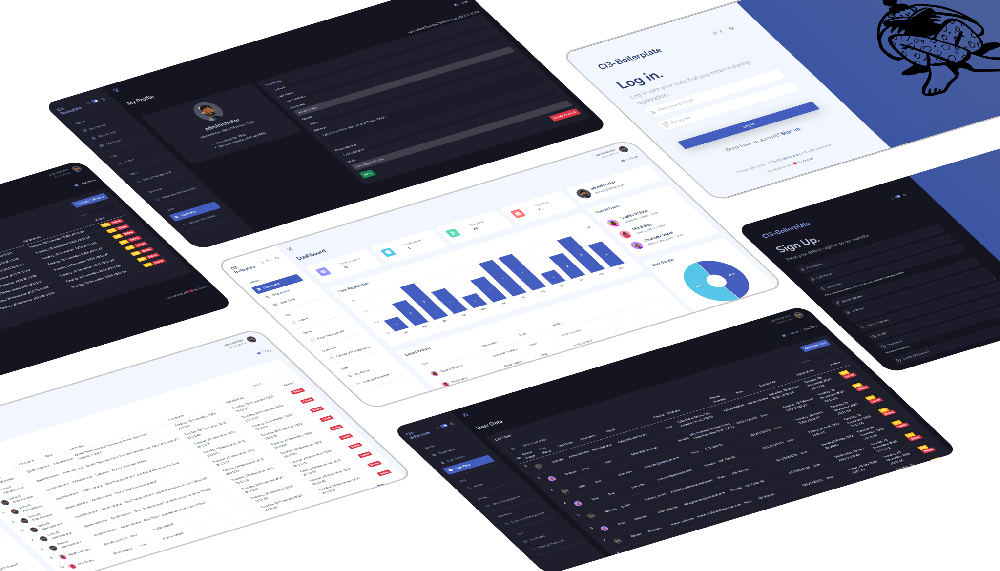
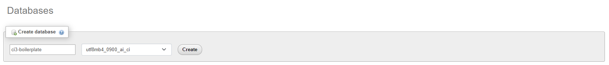
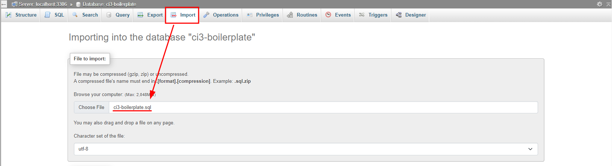
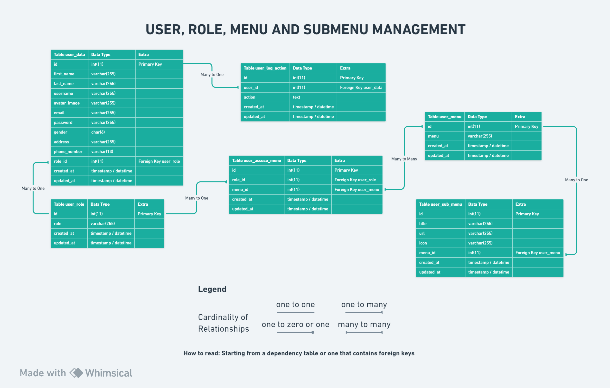

<h1 align="center">Codeigniter 3.1.13 - Boilerplate</h1>
<p align="center">This repository is a boilerplate from the Codeigniter Framework with version 3.1.13, this boilerplate has features such as authentication (signin and signup), user roles, management menus and submenus, log action</p>



# Table of Contents

- [Tech Stack](#tech-stack)
- [Dependency](#dependency)
- [How to Install](#how-to-install)
  - [Clone or Download this repository](#clone-or-download-this-repository)
  - [Create file `.env.development`](#create-file-envdevelopment)
  - [Setup Database](#setup-database)
    - [GUI](#gui)
    - [CLI](#cli)
- [ERD (Entity Relationship Diagram)](#erd-entity-relationship-diagram)

## Tech Stack

This boilerplate build with some tech stack, such as:

> **NOTE**:
>
> - `Codeigniter` for backend framework
>
> - `Mazer` for UI template from frontend framework `Bootstrap`

- [Codeigniter Version 3.1.13](https://codeigniter.com/userguide3/installation/downloads.html)
- [Mazer Version 2.3.0](https://github.com/zuramai/mazer/releases/tag/v2.3.0)
- [Bootstrap Version 5.3.2](https://getbootstrap.com/)
- [jQuery Version 3.7.1](https://code.jquery.com/jquery-3.7.1.min.js)
- [Simple Datatables](https://github.com/fiduswriter/simple-datatables)
- [Sweetalert Version 11.7.32](https://github.com/sweetalert2/sweetalert2/releases/tag/v11.7.32)
- [ApexCharts Version 3.44.0](https://github.com/apexcharts/apexcharts.js/releases/tag/v3.44.0)
- [Fontawesome Version 5.15.4](https://fontawesome.com/v5/download)
- [Dripicons Version 2.0.0](https://github.com/amitjakhu/dripicons/releases/tag/2)
- [PHP Dotenv for Codeigniter](https://github.com/agungjk/phpdotenv-for-codeigniter)

## Dependency

> **NOTE**:
>
> - For PHP, MySQL and Apache you can install with bundle software like `XAMPP`, `MAMP`, `LAMP` or `Laragon`
>
> - `Git` for cloning or downloading this repository

- [PHP 5 ~ 8.0](https://www.php.net/releases/8.0/en.php)
- [MySQL 5.1+](https://downloads.mysql.com/archives/community/)
- [Apache](https://httpd.apache.org/)
- [Git](https://git-scm.com/downloads)

## How to Install

### Clone or Download this repository

> **NOTE**:
>
> Save this clone on PATH where webserver can load such as `xampp/htdocs`, `/var/www`, `/srv/http` or `laragon/www`

- Clone this repository using SSH

```shell
git clone git@github.com:armandwipangestu/ci3-boilerplate.git
```

- Clone this repository using HTTPS

```shell
git clone https://github.com/armandwipangestu/ci3-boilerplate.git
```

### Create file `.env.development`

```sh
cd ci3-boilerplate
```

```sh
cp .env.example .env.development
```

> **NOTE**:
>
> Change the `.env.development` fields with your configuration (such as database name, etc)
>
> Default configuration is:
>
> ```
> # Database Connection
> DB_HOSTNAME=localhost
> DB_USERNAME=root
> DB_PASSWORD=
> DB_NAME=ci3-boilerplate
> DB_CONNECTION=mysqli
>
> # BASE PATH
> # use localhost
> BASE_URL=/ci3-boilerplate
> # use pretty url from laragon, like `ci3-boilerplate.test`
> #BASE_URL=
>
> # APP NAME
> APP_NAME=CI3-Boilerplate
> ```

### Setup Database

#### GUI

- Create a new Database with GUI

  

- Import `ci3-boilerplate/database/init/with-data/ci3-boilerplate.sql` to the database using phpmyadmin or GUI

  

#### CLI

- Create a new Database with CLI

```sql
CREATE DATABASE ci3_boilerplate;
```

- Import schema to database using CLI

```shell
mysql -u root -p ci3_boilerplate < database/init/with-data/ci3-boilerplate.sql
```

or if you use powershell terminal, you can run this command:

```pwsh
Get-Content 'database\init\with-data\ci3-boilerplate.sql' | mysql -u root -p ci3_boilerplate
```

## List Default Account Login

| Email             | Username      | Password      | Role          |
| ----------------- | ------------- | ------------- | ------------- |
| default@admin.com | administrator | 123qweasdzxc  | Administrator |
| default@user.com  | user          | 123qweasdzxcz | User          |

## ERD (Entity Relationship Diagram)

You can view this ERD on this link [whimsical.com/ci3-V8Rd3SHVZDQjRKyERyLobu](https://whimsical.com/ci3-V8Rd3SHVZDQjRKyERyLobu)


